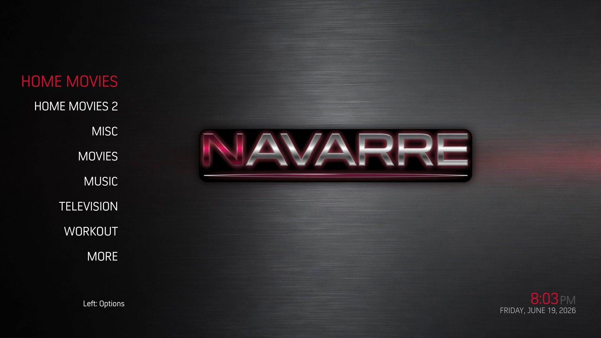
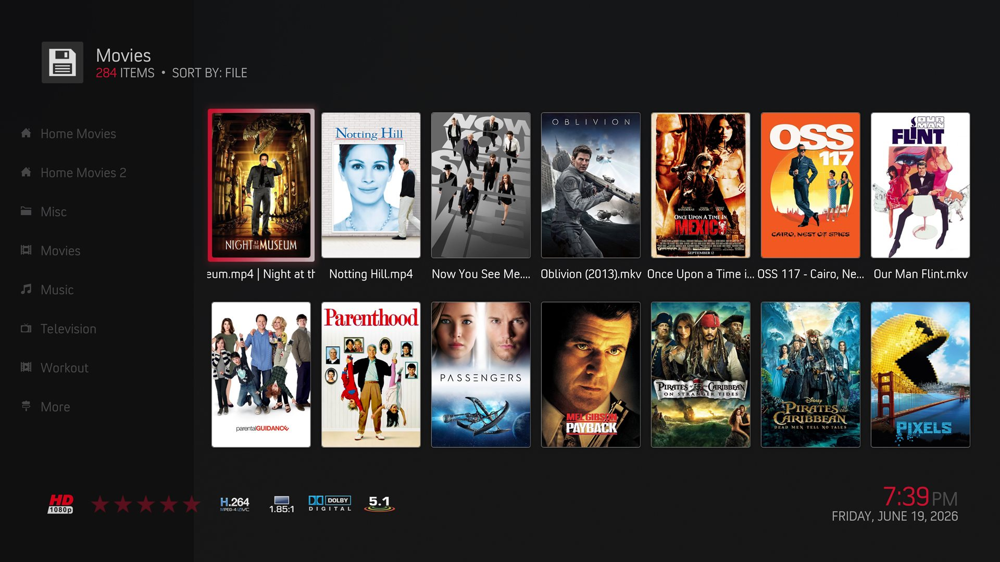
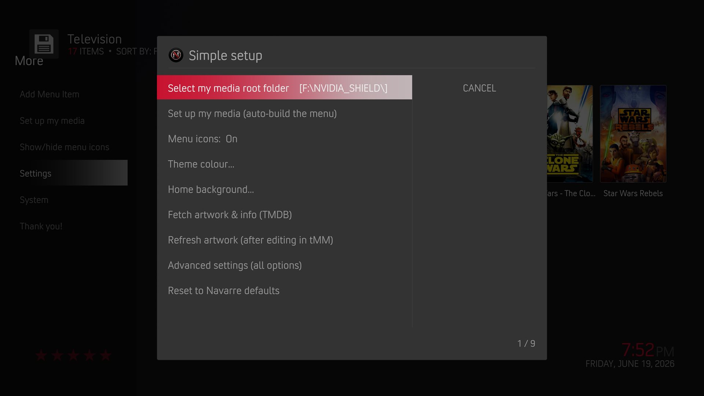
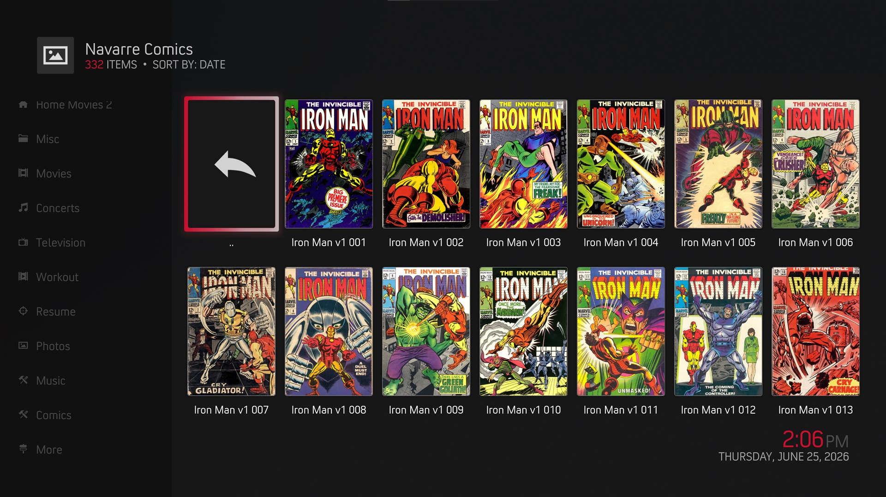

# Navarre

A simple, remote-friendly Kodi skin for browsing **your own folders** of movies, TV,
music, photos, and comics - pick a folder, see a wall of posters, press play. No
library flattening, no accounts, no clutter. Built for the couch and a D-pad.

> A personal fork of **[Arctic: Zephyr - Reloaded](https://github.com/beatmasterRS/skin.arctic.zephyr.mod)**
> by beatmasterRS, itself based on the original **Arctic: Zephyr** by jurialmunkey.
> Licensed **CC BY-NC-SA 3.0**.

For Kodi **21 (Omega)**. **This repo is the Navarre add-on repository** - install it
once and Kodi keeps the skin up to date automatically.

> **Current skin version: 1.5.4.** The installer below stays at `1.0.1` on purpose -
> it is the one-time *repository* installer, not the skin. You install it once, and
> Kodi auto-updates the skin (and its helpers) from there. So `1.0.1` is the right
> file to grab even though the skin itself is well past it.

## Install
1. Download **[`repository.navarre-1.0.1.zip`](https://github.com/NavarreDR/navarre-repo/releases/download/1.0.1/repository.navarre-1.0.1.zip)** from the [Releases](https://github.com/NavarreDR/navarre-repo/releases) page (it's under **Assets**). This is the one-time installer; the skin updates itself afterward.
2. Kodi → **Settings → Add-ons → Install from zip file** → pick that zip (enable
   *Unknown sources* if prompted).
3. **Install from repository → Navarre Repository → Look and feel → Skin → Navarre.**
4. Updates arrive automatically from here on - you'll land on the latest skin
   (currently 1.5.4) and stay current.

## Why
Kodi plus a stock skin makes a *simple* media UI surprisingly hard to reach. Navarre's
north star is **KISS**: install it, point it at your media folder, and you're browsing
in **minutes, not hours** - power stays available but is never required.

## Features
- **Folder browsing** (Files mode) - your James Bond folder, your Season folders, all
  preserved exactly as they sit on disk. No library flattening.
- **Poster-wall view everywhere** by default (a dense, Google-Play-style grid), with a
  **two-pane sidebar** across Movies, TV, Music, Photos, and Comics.
- **Continue watching / Resume** - your in-progress films and shows in one list, resume
  where you left off (pressing Back during a movie stops it and saves your place).
- **One-press "Set up my media"** - point at a root folder and the whole menu is built
  from its subfolders.
- **Self-managing menu** - add, rename, move, re-icon, or delete items right from the
  menu (press **Left** on an item).
- **Simple settings page** - the options that matter, with an escape hatch to full Kodi
  settings.
- **On-screen hints** and a **first-run bootstrap** that installs sane defaults and
  offers media setup.
- **Comics with real covers** - `.cbz`, `.cbr`, *and* `.pdf` show their actual front
  cover in the wall, instead of Kodi's montage of inner pages. It reads image-based
  comic PDFs (which Kodi can't open at all), including the copy-protected ones a lot of
  old comic sets ship as; auto-crops two-page-spread covers down to just the cover; and
  fills big folders' covers in the background so hundreds of issues don't freeze it. All
  in Kodi's built-in Python, no extra modules.

## Screenshots

*Home - a clean vertical menu of your own folders.*

*Poster-wall browsing - your media as a dense grid of posters.*

*Simple settings - the options that matter, on one screen.*

*Comics - real covers for your `.cbz`, `.cbr`, and `.pdf`, in a poster wall.*

## Getting help
- **A question or "how do I…?"** → [Discussions](https://github.com/NavarreDR/navarre-repo/discussions)
- **A bug or a feature request** → [Issues](https://github.com/NavarreDR/navarre-repo/issues)
- Common questions (install, posters not updating, media setup) are answered in
  **[SUPPORT.md](.github/SUPPORT.md)**.

## Support the project
Navarre is free and stays free (CC BY-NC-SA 3.0, non-commercial). If it's useful and
you'd like to chip in toward my time on it, there's a **Sponsor** button at the top of
the repo (and a voluntary donate link inside the skin's menu). Entirely optional.

## Credits
- **jurialmunkey** - original *Arctic: Zephyr*.
- **beatmasterRS** - *Arctic: Zephyr - Reloaded*, the skin this is forked from. If you'd
  like to support the upstream work Navarre is built on, you can
  [tip beatmasterRS here](https://www.paypal.me/beatmasterrs).
- Icons from iconmonstr.com; some from metroicon.net (courtesy of Piers).

Licensed **CC BY-NC-SA 3.0** - keep the attribution, keep the same license, don't sell it.
